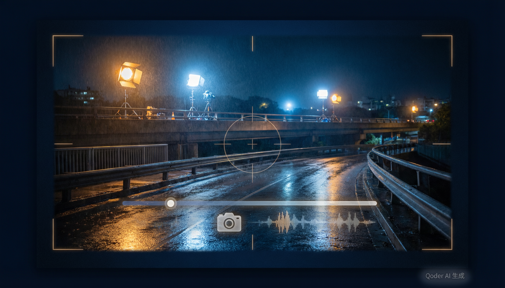

<p align="center">
  
</p>

# Kling & Seedance Prompt Engineering

[](LICENSE)

写给用可灵和 Seedance 做视频的人。不是提示词词典——是一套导演工作方法。

核心主张只有一句话：**别跟模型要"电影感"，告诉它这个镜头对观众做了什么。** "Cinematic, beautiful, 4k" 是愿望，不是方向。模型需要的是：谁在画面里、做什么动作、摄影机怎么动、光从哪来、观众听到什么。这些答出来，"电影感"是副产品。

**支持模型：** Kling 3.0 / 3.0 Omni / O1 / 2.6 / 2.5 Turbo · Seedance 2.5 / 2.0
**支持模式：** 文生视频 · 图生视频 · 多图参考 · 视频延长 · 运动迁移 · 口型同步 · 多镜头叙事
**最高规格：** 4K / 15s（可灵 3.0）· 30s（Seedance 2.5）· 原生音频 · 智能分镜

两个模型的脾气不同：可灵对东方美学和口型同步理解更好，Seedance 对中文长文本和动态场景更流畅。本项目的 Skill 会根据你的内容自动建议用哪个。

---

## 30 秒上手

**装 Skill，然后说话就行：**

```bash
# Claude Code
curl -sL https://raw.githubusercontent.com/Yuyyxz/kling-prompt-engineering/main/install.sh | bash -s claude

# Cursor
curl -sL https://raw.githubusercontent.com/Yuyyxz/kling-prompt-engineering/main/install.sh | bash -s cursor

# 自定义目录
curl -sL https://raw.githubusercontent.com/Yuyyxz/kling-prompt-engineering/main/install.sh | bash -s generic -d ~/.custom/skills/
```

装完对 AI 说"帮我拍一个产品视频"。它会问你两三个问题，然后给你一个可以直接粘进可灵或 Seedance 的提示词。不需要背公式。

**不想装东西？** 看 [cheatsheet.md](cheatsheet.md)，一页纸，打完印贴墙上。

---

## 它怎么工作

根目录的 [`SKILL.md`](SKILL.md) 是入口（标准 Claude Code / Cursor 格式）。逻辑很简单：

你说一句话 → 它判断够不够 → 够就直接出词，不够就问最多两个问题 → 出词之前过一遍质量检查（有没有空话、有没有光源、是不是一个镜头塞了三个动作）。

复杂需求（多集叙事、IP 风险、失败诊断）走完整流程，9 个环节逐步确认。简单需求不会被迫走完整流程——这是对用户时间的尊重。

子 Skill 在 `skills/*/SKILL.md`，各有分工：模板库、风格标签、分镜表。

---

## 工具

```bash
# 检查你的提示词有没有空话（cinematic/beautiful/4k 这类）
python scripts/prompt_lint.py "你的提示词"

# 自动评测（需要 claude CLI 或 API key）
python evals/run_evals.py

# 验证 skill 文件格式
python scripts/validate_all.py skills/
```

---

## Skills

| Skill | 用途 | 触发词 |
|-------|------|--------|
| `director-engine.skill` | 导演引擎：意图→技术执行 | "帮我拍"、"AI视频"、"可灵" |
| `kling-screenwriting.skill` | 编剧助手 | "编剧"、"写剧本"、"故事" |
| `kling-templates.skill` | 即用模板库（30+类型） | "模板"、"给我一个提示词" |
| `kling-style-tags.skill` | 风格标签系统 | "风格"、"宫崎骏"、"赛博朋克" |
| `kling-storyboard.skill` | 分镜表输出 | "分镜"、"storyboard" |
| `timeline-format.skill` | 时间轴格式提示词 | "时间轴"、"timeline" |
| `domain-skills.skill` | 15个行业垂直模板 | "电商"、"美食"、"房地产" |
| `failure-atlas.skill` | 失败诊断与修复 | "生成失败"、"效果不好" |
| `anti-slop.skill` | 弱词替换 | "提示词太虚"、"不具体" |

完整列表见 [`skills/`](skills/) 目录。

---

## 提示词公式

```
[风格锚：真实相机+镜头] + [主体+一个动作] + [镜头运动] + [光源] + [声音] + [约束]
```

**实战验证的写法（自然语言流，不用标签）：**

```
Anamorphic widescreen. Simulated ARRI Alexa 35 with Panavision Ultra Speed MKII lens, 24mm, T1.9.
雨夜工业天桥，巨型锈蚀金属闸门从画面两侧缓缓合拢。闸门占满画面上方三分之二，
底部最后一道缝隙中，一个渺小的黑色风衣人影正侧身通过。
琥珀色工作灯在薄雾中散射出锥形光束，月光在湿金属表面拉出冷蓝色高光。
低角度仰拍，广角畸变强化钢铁的压迫感。手持呼吸感微晃。
雨滴打在钢铁上的回响，闸门电机低频嗡鸣渐强，最后一丝光消失。
```

注意：没有 "Camera:" "Lighting:" 这些标签。模型要的是自然语言，不是填表。标签是给你自己规划用的，不是给模型看的。

**导演五问（写提示词前先回答）：**

1. **功能** — 这个场景在故事中做什么？（引入/深化/转折/收束）
2. **转折** — 价值反转是什么？（安全→威胁 / 陌生人→盟友）
3. **视角** — 我们在谁的体验里？
4. **权力** — 谁持有权力，如何流动？
5. **潜台词** — 什么是真实但未说出的？

详见 [01-directing-engine.md](01-directing-engine.md)。

---

## Anti-Slop：空话替换

> If a word can't be detected by a camera, microphone, light meter, or stopwatch — rewrite it.

| Empty Word | Replace With |
|-----------|-------------|
| Cinematic | Shot size + movement + lighting + color grade |
| Epic | Physical scale + crowd + camera distance |
| Breathtaking | Visible contrast / reveal / motion |
| 8K / Masterpiece | DELETE |
| Moody / Atmospheric | Light source + color temp + ambient sound |
| Premium / Luxurious | Material + whitespace + controlled lighting |

**Negation Rule:** "No blur" → "Hands resting still on the table." 否定句只放在约束槽。

详见 [09-anti-slop.md](09-anti-slop.md)。

---

## 文档索引

| Doc | Content |
|-----|---------|
| [01-directing-engine](01-directing-engine.md) | 导演引擎：导演五问 → 一致性原则 → 节拍编排 → 引导式构建 → 魔法前缀 |
| [02-shot-language](02-shot-language.md) | 镜头语言：景别、角度、运动、支撑、FPV/无人机 |
| [03-t2v-guide](03-t2v-guide.md) | 文生视频：提示词结构、多镜头语法、时长控制 |
| [04-i2v-guide](04-i2v-guide.md) | 图生视频：保持 vs 变化模式、角色/产品保护 |
| [05-multi-image-omni](05-multi-image-omni.md) | 多图参考：角色锁定、运动参考、相机参考 |
| [06-video-extension](06-video-extension.md) | 视频延长：续写、漂移修复、序列状态 |
| [07-motion-transfer](07-motion-transfer.md) | 运动迁移：参考视频 → 角色图 → 动作嫁接 |
| [08-audio-guide](08-audio-guide.md) | 音频：原生音频、对白、口型同步、视听关系 |
| [09-anti-slop](09-anti-slop.md) | Anti-Slop 词典：6 类空话 + 替换表 |
| [10-allocation-model](10-allocation-model.md) | 预算分配：身份保真 vs 动作幅度 vs 场景密度 |
| [11-genre-guides](11-genre-guides.md) | 类型指南：15 种类型（产品/短剧/动作/动画/美食/风景/VFX/科幻/恐怖/纪录片/MV/时尚/教育/体育/旅行） |
| [12-kling-capability-map](12-kling-capability-map.md) | 可灵能力图：能做什么、怎么用、绕过限制 |
| [13-templates](13-templates.md) | 即用模板：每种模式和场景的提示词骨架 |
| [14-model-mechanics](14-model-mechanics.md) | 模型机制：理解生成器为什么这样工作 |
| [18-troubleshooting-gallery](18-troubleshooting-gallery.md) | 故障排除：10 种常见失败模式 + 修复方法 |
| [19-cinematography-dictionary](19-cinematography-dictionary.md) | 电影摄影词典：100+ 项术语速查 |
| [20-style-tags](20-style-tags.md) | 风格标签：8 导演风格 + 8 视觉风格 + 6 情绪风格 + 组合公式 |

### Advanced References

| Doc | Content |
|-----|---------|
| [references/seedance-prompt-guide.md](references/seedance-prompt-guide.md) | Seedance 提示词实战指南（@引用语法、平台限制、场景模板） |
| [examples/before_after.md](examples/before_after.md) | 5 组 before/after 提示词对比（附"为什么有效"） |
| [adapters/model_router.yaml](adapters/model_router.yaml) | 模型路由层配置（Kling 5 模型 + Seedance 2 版本） |
| [adapters/kling_adapter.yaml](adapters/kling_adapter.yaml) | Kling 模型专属配置 |
| [adapters/seedance_adapter.yaml](adapters/seedance_adapter.yaml) | Seedance 模型专属配置 |
| [adapters/prompt_translator.yaml](adapters/prompt_translator.yaml) | 多语言提示词翻译器 |
| [examples/model_routing_examples.yaml](examples/model_routing_examples.yaml) | 5 个完整路由使用示例 |
| [workflows/video_pipeline.yaml](workflows/video_pipeline.yaml) | 条件触发确认制 6 步生产流水线 |

---

## 我想做……去哪找？

| Goal | Go to |
|------|-------|
| 不知道怎么分析场景 | [01-directing-engine](01-directing-engine.md) · Step 1 |
| 提示词太虚，没有具体镜头 | [02-shot-language](02-shot-language.md) |
| 全是 "cinematic" / "epic" | [09-anti-slop](09-anti-slop.md) |
| 一张图 → 视频，不知道写什么 | [04-i2v-guide](04-i2v-guide.md) |
| 多图参考，角色分配不清 | [05-multi-image-omni](05-multi-image-omni.md) |
| 视频延长接不上 | [06-video-extension](06-video-extension.md) |
| 角色动作迁移 | [07-motion-transfer](07-motion-transfer.md) |
| 加对白 / 口型同步 | [08-audio-guide](08-audio-guide.md) |
| 角色脸融了 / 产品 logo 变形 | [10-allocation-model](10-allocation-model.md) |
| 不知道可灵能做什么 | [12-kling-capability-map](12-kling-capability-map.md) |
| 想要现成模板改一改 | [13-templates](13-templates.md) |
| 生成失败了怎么修 | [18-troubleshooting-gallery](18-troubleshooting-gallery.md) |

---

## 常见坑

1. **写 "cinematic" 等抽象词。** 模型无法处理抽象评价，用物理描述替代。
2. **一个镜头塞太多动作。** 一镜 = 一拍 = 一变。多动作拆成多段。
3. **用否定句当质量保险。** "No blur, no distortion" 反而会召唤这些概念。描述你要的。
4. **重复描述参考图已有的信息。** I2V 只写图片无法展示的：运动、光变、声音。首行写 "Keep X unchanged"。
5. **对白太长。** 15 秒口型预算：中文 = 一个短分句，英文 = 5-10 词。
6. **用输出当续写参考。** 永远用原始参考图重新锚定。
7. **不声明排除参考角色外貌。** 运动参考会携带外貌，必须写 "Do not copy performer's appearance"。
8. **期望文字/logo 渲染。** 可灵 3.0 已支持原生文字渲染，但长段落/小字号仍建议后期。
9. **用标签格式喂模型。** "Camera: ... Lighting: ..." 是规划格式，不是提示词格式。模型要自然语言流。
10. **没有风格锚。** 不写真实相机/镜头型号，模型只能猜"电影感"是什么。写 "Shot on ARRI Alexa 35, Panavision 24mm T1.9" 比写 "cinematic" 有效一百倍。

---

## 实战验证

以下提示词全部通过 `prompt_lint.py` 检查（0 Error, 94/100），并用可灵官方 API 实际生成：

| 场景 | 镜头 | 画幅 | 分辨率 | 时长 | 积分 | prompt_lint |
|------|------|------|--------|------|------|-------------|
| 工业闸门（压迫） | 24mm 广角仰拍 | 16:9 | 3840×2160 | 5s | 15 | 94/100 |
| 人像（亲密） | 85mm T1.5 浅景深 | 16:9 | 1920×1080 | 5s | 6 | 94/100 |
| 巨物佛像（敬畏） | 14mm 超广竖摇 | 9:16 | 2160×3840 | 10s | 30 | 94/100 |
| 诺兰三镜预告 | IMAX 65mm 多焦段 | 16:9 | 1920×1080 | 10s | 12 | 94/100 |

API 格式：`POST api-beijing.klingai.com/text-to-video/kling-3.0`，参数在 `settings` 对象下。详见 [12-kling-capability-map.md](12-kling-capability-map.md)。

---

## 项目结构

```
kling-prompt-engineering/
├── README.md                          # 本文件
├── SKILL.md                           # 导演引擎入口（Claude Code / Cursor 原生格式）
├── CHANGELOG.md                       # 版本历史
├── CLAUDE.md                          # 项目规范（给 AI 助手看的编辑规则）
├── SKILL_SCHEMA.md                    # .skill 文件格式规范
├── cheatsheet.md                      # 一页纸速查（A4 可打印）
├── LICENSE                            # MIT License
├── install.sh                         # 一键安装脚本
├── requirements.txt                   # Python 依赖
├── assets/
│   └── og-cover.png                   # GitHub 社交预览图
├── 01-directing-engine.md             # 导演方法论
├── 02-shot-language.md                # 镜头语法参考
├── 03-t2v-guide.md                    # 文生视频指南
├── 04-i2v-guide.md                    # 图生视频指南
├── 05-multi-image-omni.md             # 多图参考
├── 06-video-extension.md              # 视频延长
├── 07-motion-transfer.md              # 运动迁移
├── 08-audio-guide.md                  # 音频与口型同步
├── 09-anti-slop.md                    # Anti-Slop 词典
├── 10-allocation-model.md             # 预算分配模型
├── 11-genre-guides.md                 # 类型指南
├── 12-kling-capability-map.md         # 可灵能力与限制（含官方 API 文档）
├── 13-templates.md                    # 即用提示词模板
├── 14-model-mechanics.md              # 模型机制理论
├── 18-troubleshooting-gallery.md      # 故障排除案例库
├── 19-cinematography-dictionary.md    # 电影摄影词典
├── 20-style-tags.md                   # 风格标签系统
├── adapters/                          # 模型适配器
│   ├── model_router.yaml              # 模型路由配置（Kling 5模型 + Seedance 2版本）
│   ├── base_adapter.yaml              # 基础适配器接口
│   ├── kling_adapter.yaml             # Kling 适配器
│   ├── seedance_adapter.yaml          # Seedance 适配器
│   └── prompt_translator.yaml         # 提示词翻译器
├── skills/                            # Skill 文件
│   ├── README.md                      # 格式说明（SKILL.md vs .skill）
│   ├── kling-templates/SKILL.md       # 模板库（标准格式）
│   ├── kling-style-tags/SKILL.md      # 风格标签（标准格式）
│   ├── kling-storyboard/SKILL.md      # 分镜表（标准格式）
│   ├── director-engine.skill          # 导演引擎数据（legacy）
│   ├── domain-skills.skill            # 领域垂直数据（legacy）
│   └── ...                            # 更多 .skill 数据文件
├── scripts/                           # 工具脚本
│   ├── prompt_lint.py                 # 提示词质量检查（Anti-Slop 可执行版）
│   ├── validate_all.py                # Skill 格式综合验证
│   └── ...                            # 其他验证脚本
├── evals/                             # 自动评测
│   ├── cases.json                     # 6 个测试用例
│   ├── rubric.md                      # 10 条评分标准
│   └── run_evals.py                   # LLM-judge 评测脚本
├── examples/                          # 使用示例
│   ├── before_after.md                # 5 组 before/after 对比
│   └── model_routing_examples.yaml    # 模型路由示例
├── references/                        # 参考资料
│   ├── seedance-prompt-guide.md       # Seedance 提示词实战指南（官方手册）
│   ├── anti_slop_lexicon.md           # 弱词词典
│   ├── failure_atlas.md               # 失败图谱
│   └── negative_prompt_library.md     # 负面提示词库
├── workflows/                         # 生产流水线
│   └── video_pipeline.yaml            # 6 步条件触发流水线
└── research/                          # 调研文档
    └── GitHub竞品调研报告.md           # 竞品分析
```

---

## 验证

```bash
# 安装依赖
pip install -r requirements.txt

# 验证所有 Skill 文件
python scripts/validate_all.py skills/

# 验证单个文件
python scripts/validate_all.py skills/director-engine.skill
```

---

## 参与贡献

Issues and PRs welcome. 如果你有经过验证的可灵提示词技巧，欢迎分享。

提交前请运行 `python scripts/validate_all.py skills/` 确保验证通过。

## License

MIT — use freely, credit appreciated.

## Credits

Methodology ported from [seedance-2.0 Skill OS](https://github.com/Emily2040/seedance-2.0) director engine, adapted and expanded for Kling AI's specific capabilities and constraints.

---

<p align="center">
  <i>导演模型，而非微调画面。</i><br>
  <i>Direct the model. Don't tweak pixels.</i>
</p>
